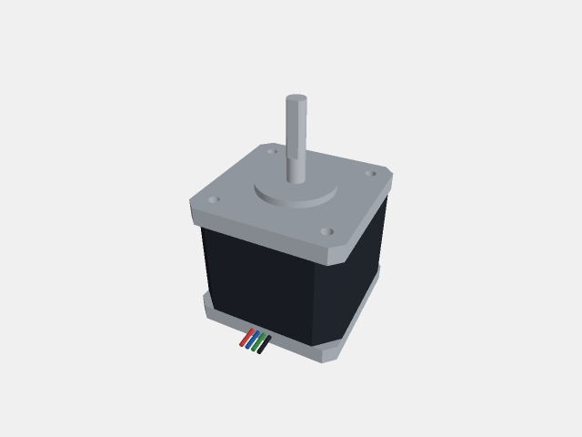

# jscad-to-parasolid

Convert JSCAD geometry and rendered modelprinter models into native Parasolid
text (`.x_t`) files. Uses [parasolidts](https://github.com/tscircuit/parasolidts)
to write a boundary representation with planar faces and shared edges.

This initial implementation exports closed, orientable polygon solids. Adjacent
coplanar polygons with matching colors are merged into single planar faces,
including faces with hole boundaries. JSCAD curves retain their polygon facets.
RGB body and face colors are preserved.
Analytic curves, enclosed cavity shells, assemblies with constraints, and feature
history are not exported.
Separate solids remain separate bodies.



## Install

```sh
bun add jscad-to-parasolid
```

The npm package ships compiled ES modules and TypeScript declarations.

## Export a model

```ts
import { jscadPlanner } from "jscad-planner"
import { jscadToParasolid } from "jscad-to-parasolid"

const model = jscadPlanner.booleans.subtract(
  jscadPlanner.primitives.cuboid({ size: [20, 16, 6] }),
  jscadPlanner.primitives.cylinder({ radius: 3, height: 10, segments: 24 }),
)

await Bun.write("bracket.x_t", jscadToParasolid(model))
```

Input dimensions default to millimeters and are converted to Parasolid meters.
Pass `{ units: "m" }` for geometry already expressed in meters.

The public operation API uses `jscad-planner`. Like `jscad-to-step`, the
converter evaluates that plan internally with `@jscad/modeling` before writing
the native boundary representation.

Accepted inputs are a `jscad-planner` operation, a JSCAD `geom3`, an array of
either, or a rendered model shaped like
`{ geometries: [{ geom, color? }] }`, where `geom` can also be a planner operation.
Pending transforms are applied without
mutating the input. Empty entries in a rendered model are ignored; an entirely
empty model fails with an error.

Modelprinter strings must first be rendered by `jscad-electronics`:

```sh
bun add jscad-electronics
```

```ts
import { jscadPlanner } from "jscad-planner"
import { getJscadModelForFootprint } from "jscad-electronics/vanilla"
import { jscadToParasolid } from "jscad-to-parasolid"

const model = getJscadModelForFootprint(
  "sheetmetal_channel_w28_l24_h16_t1_r2",
  // The renderer currently declares its adapter as the modeling implementation.
  jscadPlanner as unknown as Parameters<typeof getJscadModelForFootprint>[1],
)
await Bun.write("channel.x_t", jscadToParasolid(model))
```

`jscadToParasolid(input, { mergeCoplanarFaces: false })` disables coplanar
face merging. Merging and boundary extraction happen in this converter; the
Parasolid writer serializes the explicitly supplied faces.
`jscadToParasolidBodies(input)` exposes the unmerged resolved polygon bodies
for inspection before serialization. Open meshes, degenerate faces,
non-orientable meshes, and unsupported geometry fail instead of silently becoming
surfaces.

## Colors

Colors are stored in the `.x_t` itself using standard Parasolid body
(`SDL/TYSA_COLOUR_2`) and face (`SDL/TYSA_COLOUR`) attributes. Geometry colors
override rendered-entry colors; polygon colors override the body default.
Planner `colors.colorize(...)` operations are supported. Inputs accept normalized
RGB/RGBA arrays, byte RGB arrays, hexadecimal strings, and CSS color names.
Alpha is omitted: this release preserves RGB appearance, not transparency or
material properties. Color display also depends on the importing CAD program.

## Validation and visual snapshots

```sh
bun install
python3 -m venv .venv
.venv/bin/python -m pip install -r scripts/validation/requirements.txt
bun test
bun run typecheck
bun run format:check
```

The Python dependencies are only needed for tests and previews, not for export.
Set `PARASOLID_PYTHON` to use an existing Python environment. `bun run test:unit`
runs the TypeScript-only tests.

Every visual test follows this path:

```text
JSCAD → .x_t → parasolid-kit → OpenCascade B-Rep → GLB → poppygl → PNG
```

[`parasolid-kit`](https://github.com/monozukuri-ai/parasolid-kit) is an independent
reader. It bridges the emitted native `.x_t` into OpenCascade; OpenCascade itself
does not directly read Parasolid. Tests require complete conversion, valid solids,
positive volume, and tessellation of every face, with healing disabled. They
compare reconstructed dimensions, surface area, and volume against the original
JSCAD geometry. The tessellated GLB is also checked for complete, consistently
oriented triangle meshes and matching area and volume.

Native RGB attributes are decoded by the independent reader and mapped to GLB
faces through its topology records. No source-color sidecar is used. A canonical
box round trip verifies a face override, and SOIC8 checks its housing/lead palette.

Each model has two 640 × 480 poppygl snapshots: an upper view and the opposite
underside view. The temporary display scene is centered and scaled to fit the
camera; the exported GLB keeps its meter units. Every vertex must lie inside
the camera frustum. This prevents poppygl's minimum near plane from clipping
millimeter-sized components such as SOIC8 and 0402. A regression also checks
that differently scaled copies produce the same complete preview.

A checked-in PoppyGL patch gives coplanar surfaces deterministic depth priority,
preventing stripes on flush DFN8 pads. It affects preview rasterization only;
exported geometry and GLB buffers remain unchanged.

The 16 native fixtures cover boxes, a through-hole, multiple bodies, SOIC8,
0402, SOT223, DFN8, NEMA8 and NEMA17 motors, spur/helical/worm gears, a socket
bolt, and sheet-metal channel/plate/angle models. Exact catalog strings, body
counts, and features to inspect are in
[catalog-models.ts](tests/fixtures/catalog-models.ts). The box also exercises
typed parsing and canonical reserialization before import.

CI runs the complete pipeline. Generated `.x_t`, `.glb`, PNG, and JSON validation
reports are saved under `tests/visual/.artifacts/` and uploaded by CI. To update
snapshots intentionally, run `bun run test:update-snapshots` and inspect the images.

This is independent structural and geometric validation of the supported subset.
Import into Shapr3D or the Siemens Parasolid kernel has not yet been verified.

The pinned `jscad-electronics` DIP8 model contains overlapping internal pin
faces and is rejected as non-manifold. The exporter does not silently heal
that source geometry. Gear fixtures use explicit subdivision counts, and the
bolt fixture uses a smooth shank. Threaded bolts and large ribbon-screen
assemblies are not covered by the routine snapshot suite.

## References

- [tscircuit repo bootstrapping](https://github.com/tscircuit/handbook/blob/main/guides/bootstrapping-repos.md)
- [TypeScript parser libraries](https://github.com/tscircuit/handbook/blob/main/guides/ts-parser-libraries.md)
- [jscad-to-step](https://github.com/tscircuit/jscad-to-step) and [stepts](https://github.com/tscircuit/stepts)

## Publishing

Releases use `.github/workflows/npm-publish.yml` on a `v<package-version>` tag
or a manual run on `main`. The workflow validates tests, formatting, and types,
builds the npm tarball, and publishes with GitHub OIDC and provenance. It does
not use an npm token. Increment `package.json` before a new release.

Configure the npm package's trusted publisher with GitHub organization
`tscircuit`, repository `jscad-to-parasolid`, workflow filename `npm-publish.yml`,
no environment name, and **Allow npm publish** enabled. See
[npm trusted publishing](https://docs.npmjs.com/trusted-publishers/).
A new package must first be created with an authenticated initial publish
before its npm settings can be configured.

With npm 11.15+ and an authenticated maintainer session, configure the publisher
using the CLI (npm may require browser verification):

```sh
npm trust github jscad-to-parasolid --repo tscircuit/jscad-to-parasolid --file npm-publish.yml --allow-publish
```
