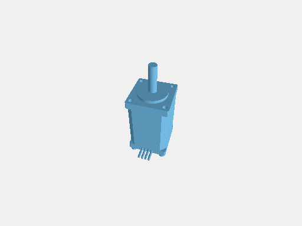

# jscad-to-parasolid

Convert JSCAD geometry and rendered modelprinter models into native Parasolid
text (`.x_t`) files. Uses [parasolidts](https://github.com/tscircuit/parasolidts)
to write a boundary representation with planar faces and shared edges.

This initial implementation exports closed, orientable polygon solids. JSCAD
curves retain their polygon facets. Colors, analytic curves, enclosed cavity
shells, assemblies with constraints, and feature history are not exported.
Separate solids remain separate bodies.



## Install

```sh
bun add github:tscircuit/jscad-to-parasolid
```

The package ships TypeScript source, following the handbook's GitHub installation
convention. Use Bun or a TypeScript-aware bundler.

## Export a model

```ts
import jscad from "@jscad/modeling"
import { jscadToParasolid } from "jscad-to-parasolid"

const model = jscad.booleans.subtract(
  jscad.primitives.cuboid({ size: [20, 16, 6] }),
  jscad.primitives.cylinder({ radius: 3, height: 10, segments: 24 }),
)

await Bun.write("bracket.x_t", jscadToParasolid(model))
```

Input dimensions default to millimeters and are converted to Parasolid meters.
Pass `{ units: "m" }` for geometry already expressed in meters.

Accepted inputs are a `jscad-planner` operation, a JSCAD `geom3`, an array of
`geom3` solids, or a rendered model shaped like
`{ geometries: [{ geom, color? }] }`. Pending transforms are applied without
mutating the input. Empty entries in a rendered model are ignored; an entirely
empty model fails with an error.

Modelprinter strings must first be rendered by `jscad-electronics`:

```sh
bun add jscad-electronics
```

```ts
import jscad from "@jscad/modeling"
import { getJscadModelForFootprint } from "jscad-electronics/vanilla"
import { jscadToParasolid } from "jscad-to-parasolid"

const model = getJscadModelForFootprint(
  "sheetmetal_channel_w28_l24_h16_t1_r2",
  jscad,
)
await Bun.write("channel.x_t", jscadToParasolid(model))
```

`jscadToParasolidBodies(input)` exposes the resolved polygon bodies for inspection
before serialization. Open meshes, degenerate faces, non-orientable meshes, and
unsupported geometry fail instead of silently becoming surfaces.

## Validation and visual snapshots

```sh
bun install
python3 -m venv .venv
.venv/bin/python -m pip install -r scripts/validation/requirements.txt
bun test
bun run typecheck
bun run format:check
```

The Python dependencies are only needed for tests and previews, not for export.
Set `PARASOLID_PYTHON` to use an existing Python environment. `bun run test:unit`
runs the TypeScript-only tests.

Every visual test follows this path:

```text
JSCAD → .x_t → parasolid-kit → OpenCascade B-Rep → GLB → poppygl → PNG
```

[`parasolid-kit`](https://github.com/monozukuri-ai/parasolid-kit) is an independent
reader. It bridges the emitted native `.x_t` into OpenCascade; OpenCascade itself
does not directly read Parasolid. Tests require complete conversion, valid solids,
positive volume, and tessellation of every face, with healing disabled. They
compare reconstructed dimensions and volume against the original JSCAD geometry.
The resulting GLB is rendered with poppygl and compared with committed snapshots.
Fixtures cover a translated and mirrored box, a through-hole, multiple bodies,
SOIC8, a modelprinter sheet-metal channel, and a modelprinter NEMA8 motor. The
box also exercises typed parsing and canonical reserialization before import.

CI runs the complete pipeline. Generated `.x_t`, `.glb`, PNG, and JSON validation
reports are saved under `tests/visual/.artifacts/` and uploaded by CI. To update
snapshots intentionally, run `bun run test:update-snapshots` and inspect the images.

This is independent structural and geometric validation of the supported subset.
Import into Shapr3D or the Siemens Parasolid kernel has not yet been verified.

## References

- [tscircuit repo bootstrapping](https://github.com/tscircuit/handbook/blob/main/guides/bootstrapping-repos.md)
- [TypeScript parser libraries](https://github.com/tscircuit/handbook/blob/main/guides/ts-parser-libraries.md)
- [jscad-to-step](https://github.com/tscircuit/jscad-to-step) and [stepts](https://github.com/tscircuit/stepts)
